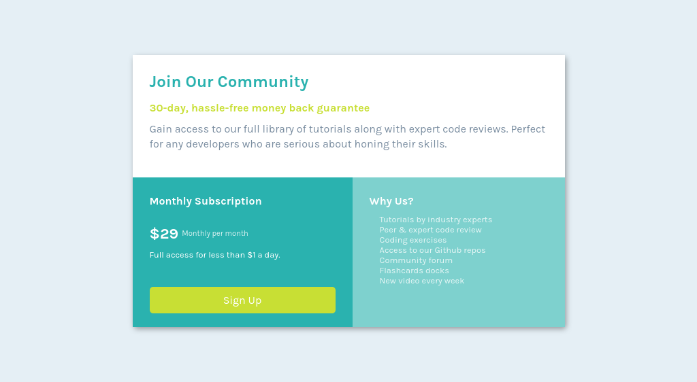

# Frontend Mentor - Single price grid component solution

### Screenshot



### Links

- Solution URL: [MySolutionURL](https://www.frontendmentor.io/solutions/responsive-single-price-grid-component-ZT_wK4tebQ)
- Live Site URL: [LiveSiteURL](https://single-price-grid-component-dusky-three.vercel.app/)

## My process

### Built with

- Semantic HTML5 markup
- CSS custom properties
- Flexbox
- CSS Grid
- Mobile-first workflow
- For styles

### What I learned

Completing the Single Price Grid Component challenge from Frontendmentor.io was a pivotal learning experience for me. It enabled me to delve into the intricacies of responsive design and effectively translate a Figma design into HTML & CSS code. This challenge not only honed my technical skills but also taught me how to think responsively while crafting designs. I'm grateful for the opportunity to grow through this project.

```html
<head>
    <meta charset="utf-8">
    <meta http-equiv="X-UA-Compatible" content="IE=edge">
    <link rel="shortcut icon" href="./assets/favicon-32x32.png" type="image/x-icon">
    <meta name="viewport" content="width=device-width, initial-scale=1.0">
    <link rel="stylesheet" href="./css/style.css">
    <link name="description" content="Frontend mentor io birusha ndegeya solution" />
    <meta name="author" content="Birusha Ndegeya"/>
    <title>Join Our Community</title>
</head>
```
```css
@media (min-width: 576px){
    #card {
        height: 400px; 
    }
    #bottom-section{
        flex-direction: row;
    }
    #bottom-left-section, #bottom-right-section {
        flex-grow: 1;
    }
}
```

### Continued development

I am transitioning towards building all of my websites using the React JavaScript Library, while adhering to the Google Material Design principles. This shift enables me to leverage the powerful capabilities of React for efficient development, while also ensuring that my designs align with the established usability and aesthetic standards advocated by Google's Material Design principles.

## Author

- Website - [birushandegeya](https://myportfolio-chi-mocha.vercel.app/)
- Frontend Mentor - [@BirushaNdegeya](https://www.frontendmentor.io/profile/yourusername)
- Twitter - [@BirushaNdegeya](https://twitter.com/BNdegeya62741)

## Acknowledgments

I am deeply grateful to Zack from Free Code Camp for his invaluable guidance throughout this project. His expertise not only helped me navigate through the challenges but also taught me the intricacies of creating responsive designs. Zack's mentorship was instrumental in organizing this project effectively, and I am truly thankful for the knowledge and skills he imparted.