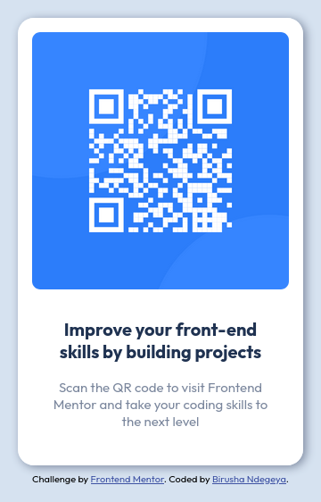

# Frontend Mentor - QR code component



## Welcome To My Solution! 👋

I'm currently engaged in developing a QR code component inspired by a design from frontendmentor.io. Utilizing the principles of HTML5 semantic markup and CSS Flexbox, I'm crafting an interactive and visually appealing element that seamlessly integrates into web applications


### What I learned

```html
<!doctype html>
<html lang="en">
	<head>
		<meta charset="utf-8">
		<meta name="viewport" content="width=device-width, initial-scale=1.0">
		<link rel="icon" type="image/png" sizes="32x32" href="./assets/favicon-32x32.png">
		<link rel="stylesheet" href="./sass/index.css" />
		<title>QR code component</title>
	</head>
	<body>
		<div class="container">
			
			<div class="wrapper">
				<h1>Improve your front-end skills by building projects</h1>
				<p>Scan the QR code to visit Frontend Mentor and take your coding skills to the next level</p>
			</div>
		</div>
		<div class="attribution">
			Challenge by <a href="https://www.frontendmentor.io?ref=challenge" target="_blank">Frontend Mentor</a>. 
		Coded by <a href="https://www.linkedin.com/in/birusha-ndegeya-243b032a9/">Birusha Ndegeya</a>.
		</div>
	</body>
</html>
```
```css
@import url('https://fonts.googleapis.com/css2?family=Outfit:wght@100..900&display=swap');

/* BASIC RESET */

*,
*::after,
*::before {
   margin: 0;
   padding: 0;
   box-sizing: border-box;
   font-family: "Outfit", sans-serif;
   font-optical-sizing: auto;
   font-style: normal;
}

img {
   display: block;
   width: 100%;
   height: auto;
}

/* VARIABLES */

:root {
   --WHITE: hsl(0, 0%, 100%);
   --LIGHT-GRAY: hsl(212, 45%, 89%);
   --GRAYISH-BLUE: hsl(220, 15%, 55%);
   --DARK-BLUE: hsl(218, 44%, 22%);
}

/* GENERAL STYLES */

html {
   background: var(--LIGHT-GRAY);
}

body {
   font-size: 15px;
   display: flex;
   height: 100vh;
   justify-content: center;
   align-items: center;
   flex-direction: column;
}

/* CONTAINER */

.container {
   max-width: 320px;
   width: 90%;
   background: var(--WHITE);
   padding: 16px;
   border-radius: 18px;
   box-shadow: 2.85405px 2.948px 10px var(--GRAYISH-BLUE);
}

.wrapper {
   overflow: hidden;
   text-align: center;
   font-size: 15px;
   padding: 24px 18px;
}

.container > img {
   margin-bottom: 8px;
   border-radius: 9px;
}

.wrapper > h1 {
   margin-bottom: 18px;
   font-size: 20px;
   font-weight: 700;
   color: var(--DARK-BLUE);
}

.wrapper > p {
   font-size: 15px;
   color: var(--GRAYISH-BLUE);
}

/* ATTRIBUTION */

.attribution {
   margin-top: 8px;
   font-size: 11px; 
   text-align: center; 
}

.attribution a {
   color: hsl(228, 45%, 44%); 
}


```